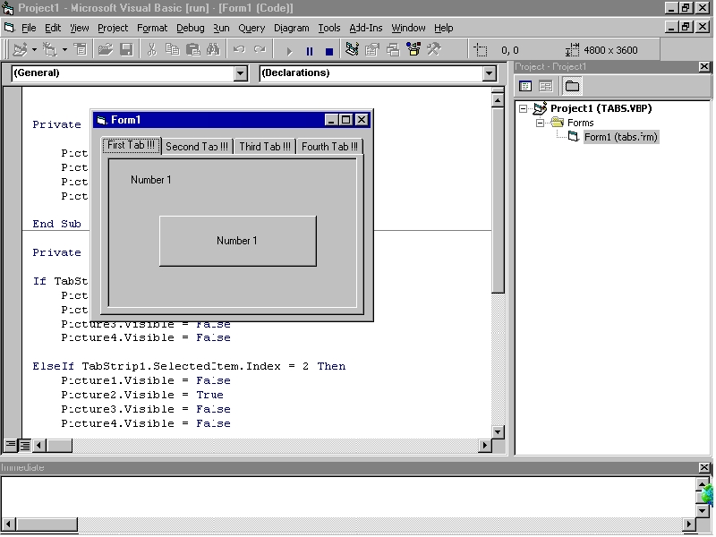



## easy tabstrip use

### Description

This is a really simple source (and program) to see how easy the use of tabstrips really is, good luck !!
 
### More Info
 

             |
---                |---
**Submitted On**   |2002-09-29 10:27:04
**By**             |[&lt;\_Nilz\_&gt;](https://github.com/Planet-Source-Code/PSCIndex/blob/master/ByAuthor/lt-nilz-gt.md)
**Level**          |Beginner
**User Rating**    |4.4 (22 globes from 5 users)
**Compatibility**  |VB 6\.0
**Category**       |[Coding Standards](https://github.com/Planet-Source-Code/PSCIndex/blob/master/ByCategory/coding-standards__1-43.md)
**World**          |[Visual Basic](https://github.com/Planet-Source-Code/PSCIndex/blob/master/ByWorld/visual-basic.md)
**Archive File**   |[easy\_tabst1379959292002\.zip](https://github.com/Planet-Source-Code/lt-nilz-gt-easy-tabstrip-use__1-39367/archive/master.zip)

